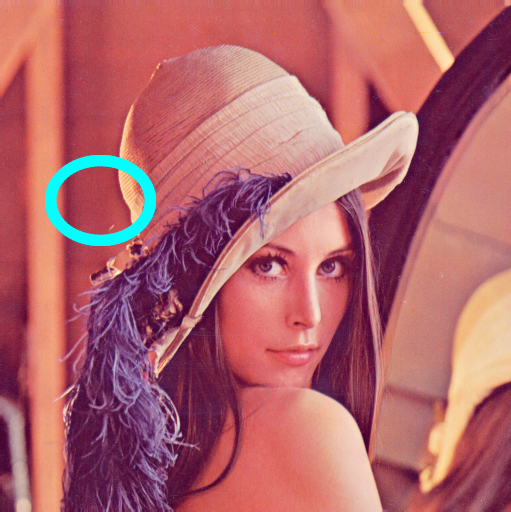
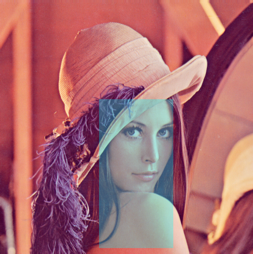
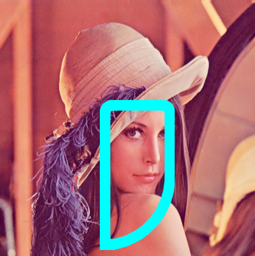
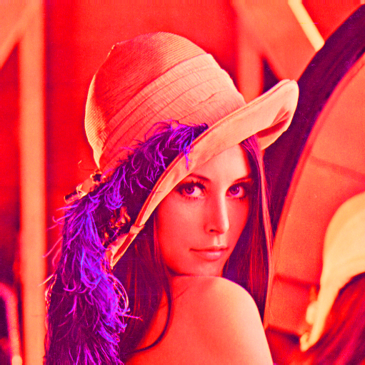
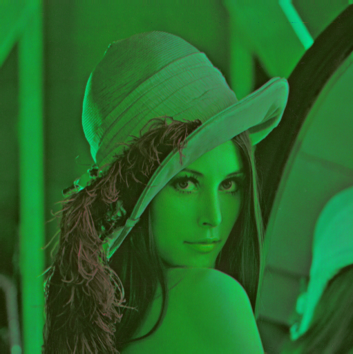
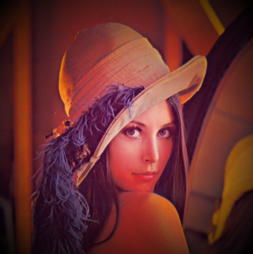
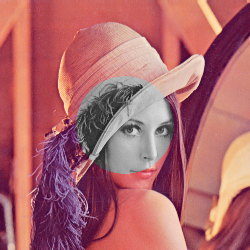

.. _PygameCV:

PygameCV
========

**PygameCV** is a set of functions allowing a game developer using pygame to enhance their game by using OpenCV's drawing functions and other effects to modify a Surface.

Tutorial
========

Importation
-----------

First, ensure **PygameCV** is installed in your Python environment by running:

.. code-block:: bash

    pip install pygame-cv

Then, import **PygameCV** with:

.. code-block:: python

    import pygamecv

Drawing
-------

You can now use pygamecv on your surfaces! For example, to draw an ellipse:

.. code-block:: python

    import pygame
    import pygamecv

    pygame.init()
    screen = pygame.display.set_mode((100, 100))
    img = pygame.image.load("Lenna.png")
    pygamecv.ellipse(
        surface=img,
        center=(100, 200),
        radius_x=50,
        radius_y=40,
        color=(0, 255, 255),
        thickness=10,  # This is pygame.draw's 'width' argument
        antialias=True,
        angle=0,
    )
    ... # The remaining of your game.

Which produces:

To draw a rectangle with transparency:

.. code-block:: python

    pygamecv.rectangle(
        surface=img,
        rect=(200, 200, 150, 300),
        color=(0, 255, 255, 100),
        thickness=0
    )

For rounded, antialiased corners:

.. code-block:: python

    pygamecv.rounded_rectangle(
        surface=img,
        rect=(200, 200, 150, 300),
        color=(0, 255, 255, 255),
        thickness=20,
        antialias=True,
        top_left=15,
        bottom_right=135,
    )

Effect
------

To saturate an image:

.. code-block:: python

    pygamecv.saturate(
        surface=img,
        factor=1
    )

To shift the hue and darken an image:

.. code-block:: python

    pygamecv.shift_hue(surface=img, value=90)
    pygamecv.darken(surface=img, factor=0.5)

For a vignette effect using a NumPy gradient:

.. code-block:: python

    import numpy as np
    
    def gradient_factor(width, height, min_radius):
        x_grid, y_grid = np.ogrid[:width, :height]
        dist_to_center = np.sqrt((x_grid - width/2 + 0.5)**2 + (y_grid - height/2 + 0.5)**2)
        unchanged = dist_to_center < min_radius
        max_radius = np.sqrt((width/2 - 0.5)**2 + (height/2 - 0.5)**2)
        factor = (dist_to_center - min_radius) / (max_radius - min_radius)
        factor[unchanged] = 0
        return factor
    
    factor = gradient_factor(*img.get_size(), min_radius=50)
    pygamecv.darken(surface=img, factor=factor)

To set saturation outside of a circle using a mask:

.. code-block:: python

    def circle_mask(width, height, radius):
        x_grid, y_grid = np.ogrid[:width, :height]
        dist_to_center = np.sqrt((x_grid - width/2 + 0.5)**2 + (y_grid - height/2 + 0.5)**2)
        return dist_to_center < radius
    
    mask = circle_mask(*img.get_size(), 100)
    pygamecv.set_saturation(surface=img, value=0, mask=mask)

Other Needs
-----------

To define your own OpenCV function and use it with pygamecv:

.. code-block:: python

    import numpy as np
    
    @pygamecv.cv_transformation
    def _cv_your_function(img: np.ndarray, **kwargs):
        ...
    
    def your_function(surface: pygame.Surface, **kwargs):
        rect = ...
        _cv_your_function(surface, rect, **kwargs)
    
    your_function(img, (11, 11), 20)

Warning
-------

Modifying a Surface using OpenCV may be slow, as copying pixel values needs to be done twice. To optimize, restrict the modified area using the smallest `Rect` possible.

Contributing
------------

Everyone is welcome to contribute to this project by proposing new features and optimizations! Your feedback is appreciated.

License
-------

This project is licensed under a **GNU GENERAL PUBLIC LICENSE**. Please refer to the :download:`license file <LICENSE>`.
